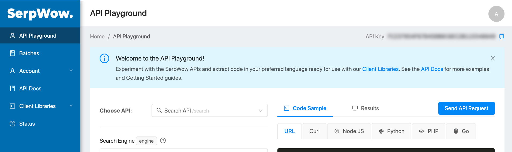

# buckwheat-scrapper-client

### Example of usage:
1. Go to https://app.serpwow.com/playground and login.
1. Copy "API key" from upper-right corner

    
1. Initialize client using  "API key"
    ```
    # Create client
    SerpWowBuckwheatClient serpWowBuckwheatClient = new SerpWowBuckwheatClient("YOUR_SERP_WOW_API_KEY");
    ```
1. Get actual buckwheat data from Google Shopping with Ukraine location
    ```
    # Actual buckwheat data from google shopping
    List<BuckwheatDTO> buckwheatDatas = serpWowBuckwheatClient.getBuckwheat();
    ```
