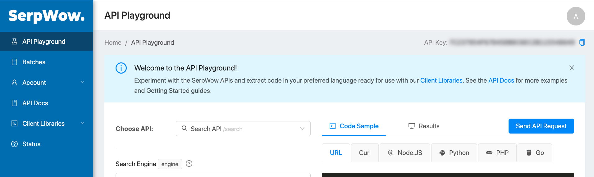

# buckwheat-service

### Get SER_WOW_TOKEN:
1. Go to https://app.serpwow.com/playground and login.
1. Copy "API key" from upper-right corner

    

### Docker

```
# Build project
$ mvn clean install

# Build image "buckwheat-service"
$ docker build -t buckwheat-service .

# Run docker container "buckwheat-service"
$ docker run -p 9999:9999 -e SERP_WOW_TOKEN="ENTER_YOUR_SERP_WOW_TOKEN" buckwheat-service
```

